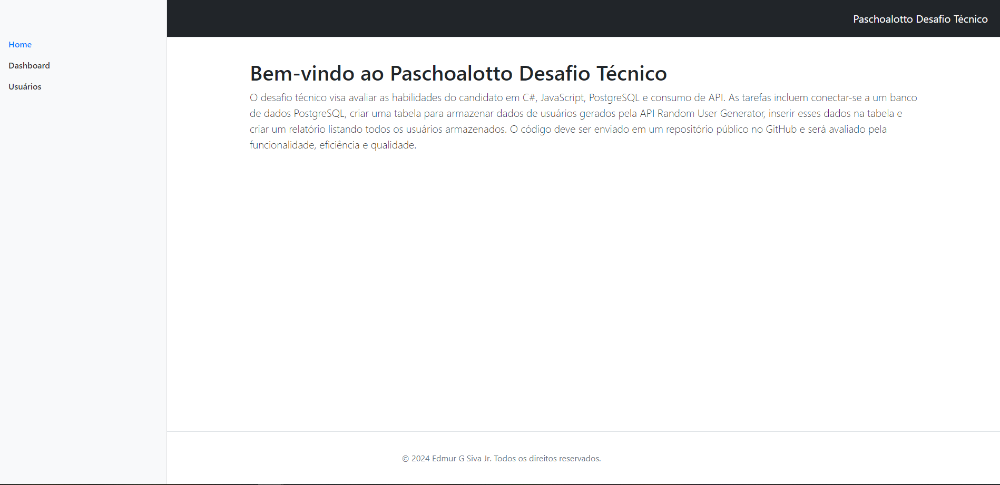
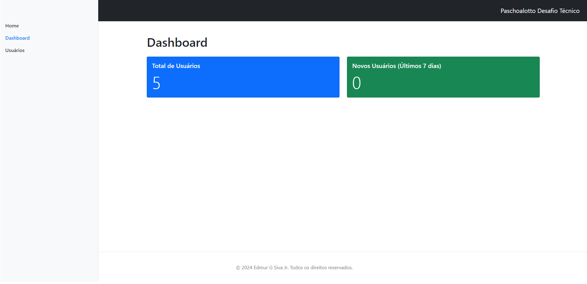
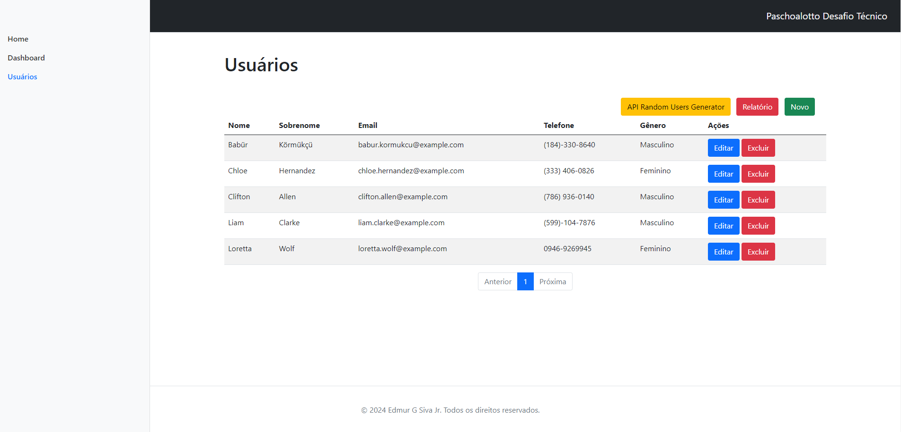
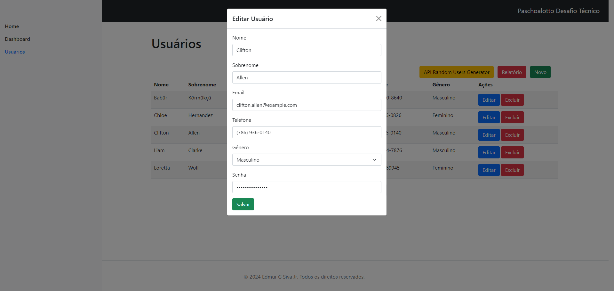

# C#, Javascript, PostgreSQL e consumo de API

 
## DESAFIO
O desafio técnico visa avaliar as habilidades do candidato em C#, JavaScript, PostgreSQL e consumo de API. As tarefas incluem conectar-se a um banco de dados PostgreSQL, criar uma tabela para armazenar dados de usuários gerados pela API Random User Generator, inserir esses dados na tabela e criar um relatório listando todos os usuários armazenados. O código deve ser enviado em um repositório público no GitHub e será avaliado pela funcionalidade, eficiência e qualidade.

## Ferramenta utilizada
. IDE - Visual Studio 2022,
. C#, ASP.Net, JavaScript, Bootsprat com metodologia MVC com CRUD

## Executar o desafio 
. No arquivo appsettings.json, mudar o acesso ao bando de dados
  ---> "DefaultConnection": "Host=localhost;Port=5432;Pooling=true;Database=PaschoalottoDesafio;User Id=postgres;Password=admin;"
  
. Depois de mudar o acesso ao banco de dados, execute controle Migrations para criar o banco de dados e a tabela Usuario

## Solution PaschoalottoDesafio

 
<h1 align="center">
    
</h1>

 
<h1 align="center">
    
</h1>

 
<h1 align="center">
    
</h1>

 
<h1 align="center">
    
</h1>
